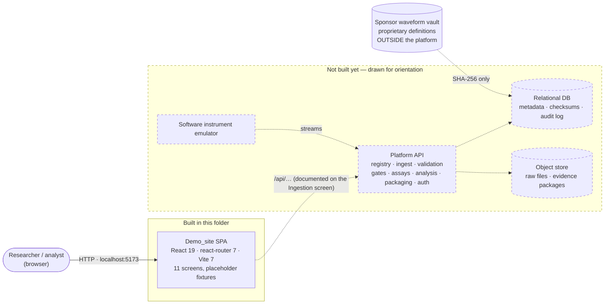
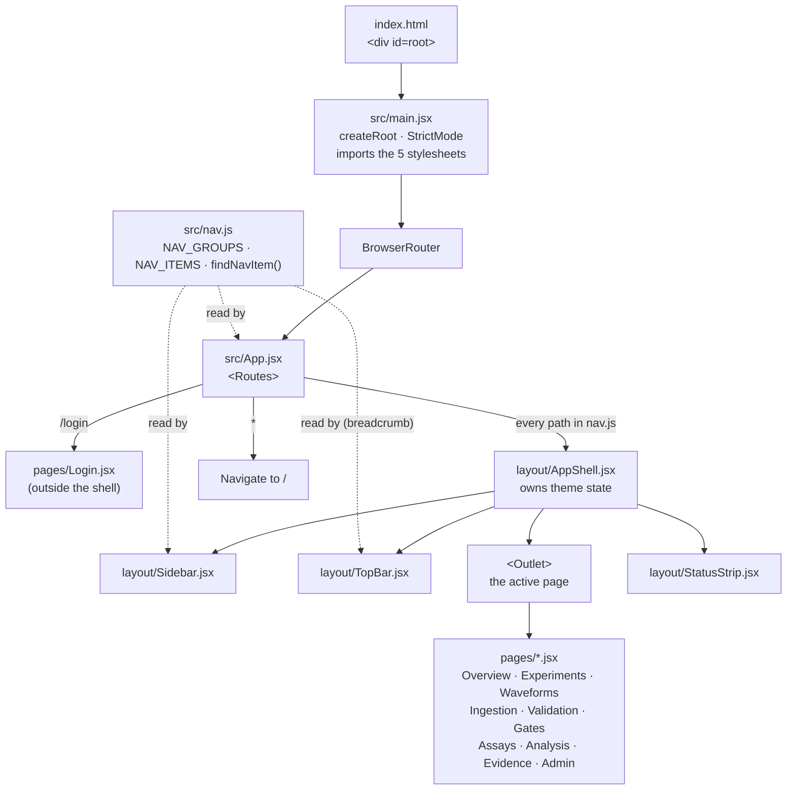
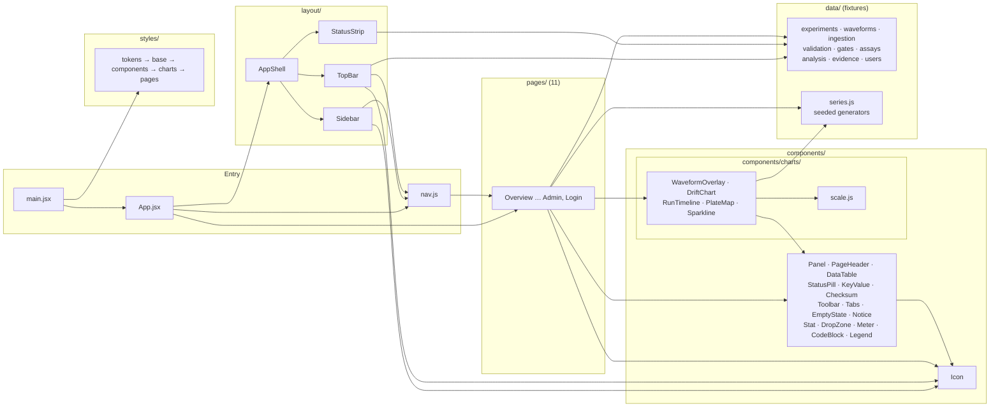
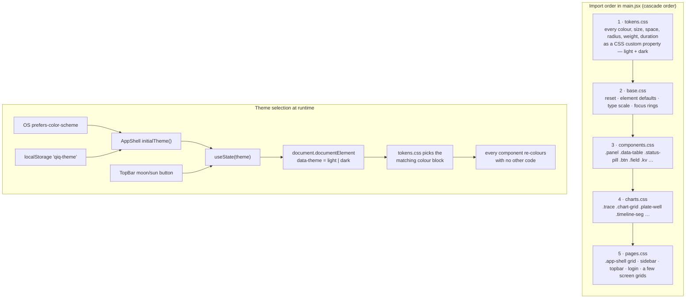
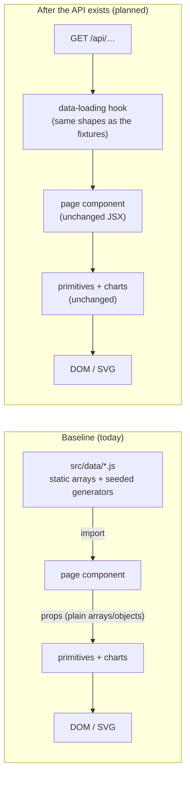
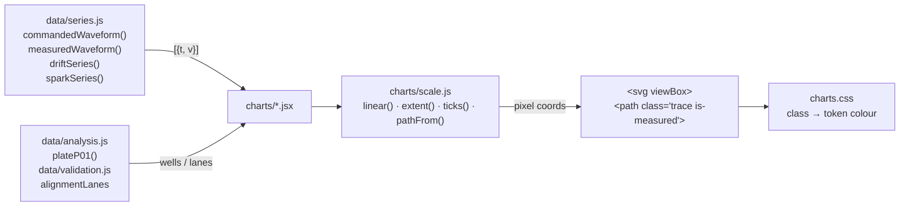
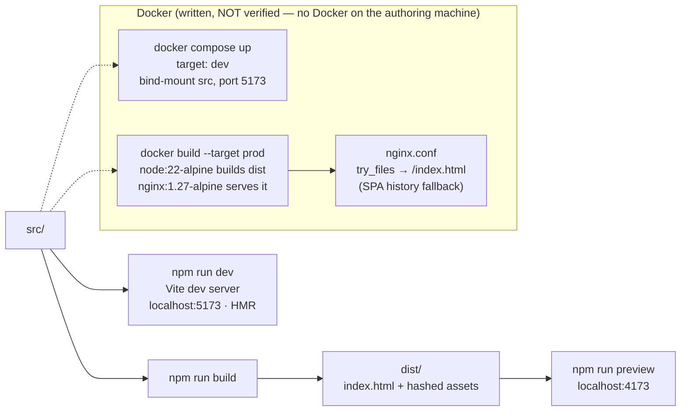
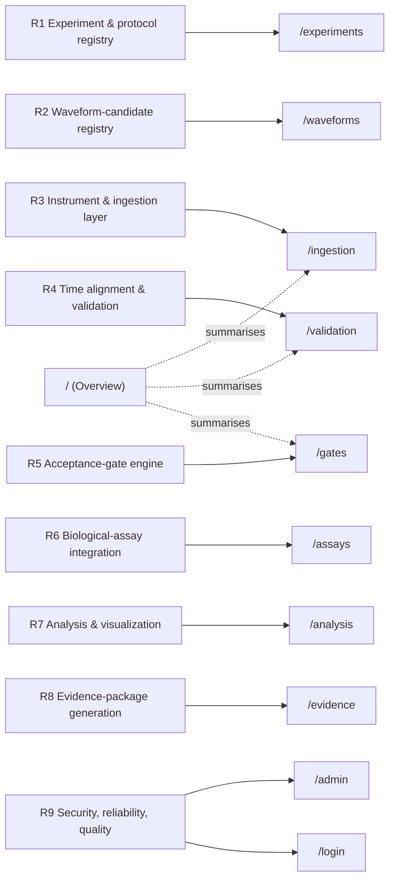

# Demo_site — Architecture

Diagrams and notes describing how the visual baseline in this folder is put
together. Every diagram is derived from the files in `Demo_site/` only; the
"future" elements are drawn dashed and labelled as such.

Diagrams are written in [Mermaid](https://mermaid.js.org). GitHub, GitLab and
VS Code (with the built-in Markdown preview) render them inline. If your
viewer does not, paste a block into <https://mermaid.live>.

Companion document: [USER_FLOWS.md](USER_FLOWS.md) describes the same system
from the user's side.

---

## 1. System context

What the baseline is, and what it is not yet.

**Notes**

- The only thing that exists is the SPA. It has no network calls. Every table,
  chart and readout renders from arrays in `src/data/`.
- The API boundary is already *documented* on the Ingestion screen so the team
  agrees on it before it is built.
- The custody rule from requirement 2 is drawn as a hard boundary: the sponsor's
  waveform definition files never enter the platform. Only their checksum does.

---

## 2. Runtime composition

How the React tree is assembled when the page loads.

**Notes**

- `nav.js` is the single registry. It imports every page component and
  exports the grouped list. `App.jsx` flattens it into `<Route>` elements;
  `Sidebar` renders it as links; `TopBar` looks up the current path in it for
  the breadcrumb. Adding a screen is one import and one object in `nav.js`.
- `AppShell` is a layout route: it renders once and swaps only the `<Outlet>`
  when the URL changes. Sidebar, top bar and status strip never re-mount.
- Login is deliberately outside the shell so it can use its own split layout.
- The CSS grid that positions the four shell regions is `.app-shell` in
  `styles/pages.css`, driven by `--sidebar-width`, `--topbar-height` and
  `--statusbar-height` from `tokens.css`.

---

## 3. Module dependency graph

Which folders are allowed to import from which. Arrows point from importer
to imported. This is the actual graph as of the baseline, not an aspiration.

**Notes**

- **Rules the graph obeys:** `components/` never imports from `pages/`,
  `layout/` or `data/`. Charts import only `scale.js`, `series.js` and
  `Legend`. Primitives import only `Icon`. This keeps every primitive
  reusable in isolation.
- **The one asymmetry:** `layout/TopBar` and `layout/StatusStrip` read
  fixtures directly (`activeExperiment`, `currentUser`, `emulator`). When the
  API lands these become the first two consumers of a global "session" context.
- `nav.js → pages` and `App.jsx → nav.js` means the route table is generated,
  not hand-maintained.

---

## 4. Styling architecture and theming

Five plain stylesheets, no preprocessor, no CSS modules, no utility classes.

**Notes**

- Only `tokens.css` contains hex colours. `grep` for `#[0-9a-f]` across
  `src/` outside that file returns nothing. That is what makes a restyle a
  one-file job.
- The dark block overrides **colour tokens only**. Layout tokens are shared,
  so the two themes cannot drift in geometry.
- Class naming is flat: block (`.status-pill`), modifier (`.is-fail`). No
  BEM double-underscores, no generated names, so a CSS-only contributor can
  find and change anything.
- Design constraints encoded in the tokens: 1px hairlines instead of shadows
  (one shadow token exists, for overlay menus only), radii of 2–3px, 13px
  body, 30px table rows, uppercase 11px micro-labels, monospace for all data
  values, amber-vs-teal chart traces.

---

## 5. Data flow — today and after the API exists

**Notes**

- Each fixture file opens with a comment naming the endpoint that replaces
  it, e.g. `experiments.js → GET /api/experiments`.
- Primitives take plain data (`columns`, `rows`, `items`, `series`). None of
  them know where the data came from, so swapping fixtures for fetches does
  not touch `components/`.
- There is no client-side state store. The only state in the app is the theme
  in `AppShell`. That is intentional for a visual baseline; a store is a
  decision for when there is behaviour to hold.

---

## 6. Screen × primitive usage

Which building blocks each screen is made of (from the actual imports).

| Screen | Panel | PageHeader | DataTable | StatusPill | KeyValue | Checksum | Toolbar | Tabs | Notice | Stat | DropZone | Meter | CodeBlock | Legend | Charts |
|---|:-:|:-:|:-:|:-:|:-:|:-:|:-:|:-:|:-:|:-:|:-:|:-:|:-:|:-:|---|
| Overview | ● | ● | ● | ● | ● | | | | ● | ● | | ● | | | |
| Experiments | ● | ● | ● | ● | ● | | ● | ● | | | | | | | |
| Waveforms | ● | ● | ● | ● | ● | ● | ● | | ● | | | | | | |
| Ingestion | ● | ● | ● | ● | ● | ● | ● | | | | ● | | | | |
| Validation | ● | ● | ● | ● | | | | | ● | | | | | ● | RunTimeline ×2 |
| Gates | ● | ● | ● | ● | | | ● | | ● | | | | | | |
| Assays | ● | ● | ● | ● | | | | | | | | | | | |
| Analysis | ● | ● | ● | ● | ● | | | ● | ● | | | | | ● | WaveformOverlay, DriftChart ×2, PlateMap |
| Evidence | ● | ● | ● | ● | | ● | | | ● | | | | ● | | |
| Admin | ● | ● | ● | ● | ● | | | | ● | | | | | | |
| Login | | | | | | | | | | | | | | | |

`Icon` is used everywhere and omitted from the table. `EmptyState` and
`Sparkline` are provided for the next phase and not yet placed on a screen.

**Notes**

- Every screen after the first was cheaper than the one before it. Ten of
  eleven screens use the same five primitives.
- The Login screen uses only `Icon`; its layout classes live in `pages.css`.

---

## 7. Chart pipeline

The charts are hand-written SVG, not a charting library.

**Notes**

- `series.js` uses a seeded PRNG (mulberry32) so every machine draws the
  identical picture. Nothing is random between renders.
- Charts draw in a fixed `viewBox` and scale by CSS width, so they need no
  resize observer.
- Colour is never set in JSX. A path gets a class (`is-commanded`,
  `is-measured`, `is-residual`) and `charts.css` resolves it to a token, so
  charts follow the theme automatically.
- Each chart has an adjacent text caption stating what the picture shows, so
  the information is not colour-only.

---

## 8. Build and deployment paths

**Notes**

- `vite.config.js` sets `host: true` so the dev server listens on `0.0.0.0`.
  That is only there so a container can publish the port; it also makes the
  dev server reachable on the LAN.
- The nginx fallback matters: without it, refreshing `/gates` in the prod
  image would 404 because the file does not exist on disk.
- `engines.node >= 22.12` in `package.json` and `.nvmrc` = `22` pin the
  runtime the baseline was verified on.

---

## 9. Screen ↔ requirement traceability

**Notes**

- The sidebar shows the requirement number (`R1`…`R9`) next to each screen
  so a reviewer can map the UI back to the sponsor's list without this document.
- The Overview is not a requirement; it is the landing page that surfaces the
  state of R3–R5 for the active experiment.

---

## 10. What is and is not implemented

| Area | Status in this folder |
|---|---|
| Visual design system (tokens, primitives, charts) | Done, themed light + dark |
| Eleven navigable screens with real URLs | Done |
| Placeholder data showing pass / warn / fail states | Done |
| Responsive down to ~1100px | Designed (grids collapse); not verified in a browser on the authoring machine |
| Any network call, auth, upload, parsing, gate evaluation | Not implemented, by design |
| Sorting, filtering, tab switching, form submission | Visual only; controls carry a tooltip saying so |
| Tests | None; there is no behaviour to test yet. The Admin screen reserves the panel where suite results will appear |
| Docker dev and prod images | Written; not executed |
