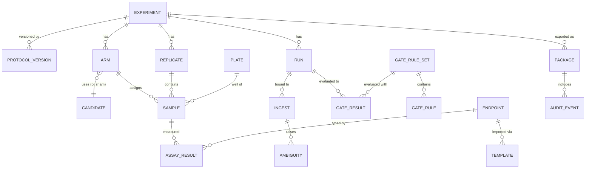

# QIQuantum Platform — Project Specification

| | |
|---|---|
| **Project** | QIQuantum Bioenergetics Experiment Data & Quality Platform |
| **Team** | UConn student development team |
| **Sponsor** | QIQuantum |
| **Status** | Draft v0.1 — 2026-09-17 |
| **Companion documents** | [ARCHITECTURE.md](ARCHITECTURE.md) · [USER_FLOWS.md](USER_FLOWS.md) · [Demo_site README](../README.md) |

Items marked **Proposed** are recommendations that the team and sponsor should
confirm before the phase that depends on them begins. Everything else is
either a sponsor requirement or a decision already made in the baseline.

---

## 1. Purpose and scope

A bioenergetics exposure experiment produces files from disconnected sources:
waveform-generator commands, oscilloscope or field-sensor traces, current and
voltage telemetry, temperature and pH logs, sample and plate maps, protocol
versions, viability counts and assay exports. Managed by hand, it is hard to
prove that a biological result is linked to the intended waveform, a stable
exposure environment, the correct sample and an acceptable replicate
structure.

The platform closes that gap. It builds an **end-to-end evidence chain** from
waveform candidate → delivered signal → exposure environment → sample and
replicate → biological outcome, and exports that chain as a versioned,
checksummed evidence package.

**In scope**

- Registry of experiments, protocols, arms, conditions, samples, replicates
  and waveform candidates.
- Ingestion of instrument files by upload and API, plus a software emulator
  so the workflow runs without hardware.
- Time alignment, validation and explicit binding of every file.
- A configurable acceptance-gate engine with reason codes.
- Assay import through templates into one canonical schema.
- Descriptive analysis and visualisation.
- Evidence-package generation, machine- and human-readable.
- Authentication, role-based access, logging, backup, tests, containers.

**Out of scope**

- Proving that OQE is biologically effective, or any clinical or causal claim.
- Wet-lab work or instrument control beyond the emulator.
- Storing proprietary waveform definitions; only their checksum is held.
- Protected health information or patient data of any kind.

**Deliverables**

1. A deployed research-use prototype accessible through a browser, with a
   documented local installation path.
2. A source repository with clean commit history, issue tracking, README,
   architecture diagrams and developer setup instructions.

---

## 2. Users and roles

| Role | Typical person | Can |
|---|---|---|
| Admin | Team lead / system owner | Everything below, plus register waveform candidates, edit gate thresholds, manage users, trigger backups |
| Investigator | Principal researcher | Create and version experiments, resolve ambiguities, run analysis, seal and export packages |
| Analyst | Data analyst | View, run analysis, export packages |
| Technician | Bench operator | View, upload and ingest files |
| Sponsor (read-only) | Sponsor reviewer | View results, export sealed packages |
| Service | Emulator, CI | Ingest via API key only |

Permissions are additive per capability and enforced in the API, not only in
the UI. The Admin screen in the baseline shows the full matrix.

---

## 3. Requirements and acceptance criteria

The nine sponsor requirement areas, each with the condition under which the
team will call it done.

| # | Area | Done when |
|---|---|---|
| R1 | Experiment & protocol registry | An experiment with versioned protocol, ≥2 arms including sham, normoxic/hypoxic conditions, plate/well assignments, cell-line and batch metadata and ≥5 replicate IDs can be created, versioned and viewed; randomised assignment and blinded labels are generated from a recorded seed |
| R2 | Waveform-candidate registry | A candidate is stored under an opaque ID with version, non-sensitive metadata, source-file name, creation date and SHA-256; a delivered file can be verified against the stored checksum without the definition ever being uploaded |
| R3 | Instrument & ingestion layer | Each of the six stream types can be ingested by CSV/JSON upload and by documented API; the emulator drives a full run end-to-end with no hardware |
| R4 | Time alignment & validation | Streams are aligned with measured offsets; missing, malformed, unit-less or rate-ambiguous records are flagged; no file is bound to a run without either an unambiguous match or a recorded human decision |
| R5 | Acceptance-gate engine | Rules with metric, operator, threshold, method, severity and reason code are stored as data; runs evaluate to PASS/WARN/FAIL with every breached code listed; changing a threshold requires no code change and is versioned |
| R6 | Biological-assay integration | ATP/luciferase, Seahorse OCR, MMP, ROS and viability exports import through templates into one canonical schema; a new endpoint is added as configuration |
| R7 | Analysis & visualisation | Overlay, run timeline, drift, plate map, QC status, replicate/batch and exposed-vs-sham views render from real data with descriptive statistics, effect size, CI and explicit exclusion reasons; a non-clinical disclaimer is always shown |
| R8 | Evidence-package generation | A versioned package per experiment contains protocol and candidate IDs, checksums, timestamps, lineage, gate results, settings, figures and audit log, as JSON/CSV plus a PDF report; the package's own hash verifies |
| R9 | Security, reliability, quality | SSO and local auth, RBAC enforced server-side, input validation, structured error log, scheduled backup with restore test, unit + integration tests in CI, `docker compose up` runs the whole stack |

---

## 4. Design principles

These five rules shape every decision below. They are visible on the
baseline screens already.

1. **Nothing is silently accepted.** Ambiguity in units, timestamps, rates or
   binding targets halts the file and asks a human. The choice, chooser and
   time are recorded.
2. **Configuration, not code, for sponsor rules.** Gate thresholds, calculation
   methods and assay templates are data with version history.
3. **Custody boundary.** Waveform definitions live in the sponsor's vault.
   The platform stores the checksum and traces by matching, never by copying.
4. **Everything is traceable.** Every file is checksummed on receipt, every
   state change is audited, every package is versioned and hashed.
5. **Descriptive, not diagnostic.** Analysis reports what was measured and
   how it was processed. No screen or export makes a clinical or causal
   determination.

---

## 5. System design

### 5.1 Architecture

Four deployable parts, all running from one `docker compose up`.

| Part | Responsibility | Technology |
|---|---|---|
| Web client | The eleven screens; all user interaction | React 19, react-router 7, Vite 7, plain CSS with design tokens — **built** (`Demo_site/`) |
| Platform API | Registry, ingest, validation, gates, assays, analysis, packaging, auth | **Proposed:** Python 3.12, FastAPI, SQLAlchemy, pandas/NumPy for stream processing |
| Storage | Metadata, checksums, audit log; raw files and packages | **Proposed:** PostgreSQL 16 for relational data; MinIO (S3-compatible) for objects, so a cloud move is a config change |
| Emulator | Generates command, trace, I/V, temperature, pH and assay streams for a chosen candidate and run | **Proposed:** Python service inside the API image, seeded and deterministic like `src/data/series.js` |

Python is proposed because the heavy work (alignment by cross-correlation,
drift calculation, effect sizes and bootstrap CIs, plate-map statistics) is
what the scientific Python stack is for, and because it lowers the barrier
for team members who come from a data rather than web background. The client
is already framework-agnostic: it talks to `/api/…` over JSON and nothing else.

Diagrams: system context, runtime composition and module graph are in
[ARCHITECTURE.md](ARCHITECTURE.md) sections 1–3.

### 5.2 Data model

Core entities and the relationships the evidence chain depends on.

Key fields:

- **CANDIDATE** — `id` (opaque, e.g. `WFC-7A31`), `version`, `sha256`,
  `source_file_name`, `created_at`, `meta` (non-sensitive JSON). No
  definition payload column exists, by design.
- **INGEST** — `sha256`, `stream_type`, `received_at`, `state`
  (`received` → `checksummed` → `validating` → `queued` | `ambiguous` |
  `bound` | `rejected`), `bound_run_id`, `detected_units`, `detected_rate`.
- **AMBIGUITY** — `kind`, `detail`, `options[]`, `resolution`,
  `resolved_by`, `resolved_at`. Open ambiguities on a run block gate
  evaluation.
- **GATE_RULE** — `metric`, `operator`, `threshold`, `unit`, `method`,
  `severity` (`warn` | `fail`), `reason_code`, `enabled`. Rules belong to a
  versioned **GATE_RULE_SET**; every result records which set evaluated it.
- **ASSAY_RESULT** — the canonical schema: `endpoint_id`, `sample_id`,
  `plate_id`, `well_id`, `value`, `unit`, `measured_at`, `meta`. New endpoints
  add rows to ENDPOINT and TEMPLATE, never columns here.
- **AUDIT_EVENT** — append-only: `at`, `actor`, `action`, `target`, `detail`.
  Ships inside every package.

Raw files and generated packages are objects in the object store, referenced
by path and hash from INGEST and PACKAGE.

### 5.3 API surface

REST over JSON under `/api`, bearer-token authenticated, OpenAPI document
served at `/api/docs`. The Ingestion screen already documents the first
group; the rest follows the same shape.

| Group | Endpoints |
|---|---|
| Registry | `/experiments`, `/experiments/{id}/versions`, `/arms`, `/replicates`, `/samples`, `/waveform-candidates`, `/waveform-candidates/verify` |
| Ingest | `POST /ingest/{command,trace,telemetry,assay}`, `GET /ingest/{id}`, `POST /ingest/{id}/bind`, `GET /ingest/queue` |
| Validation | `/runs/{id}/alignment`, `/validation/ambiguities`, `POST /validation/ambiguities/{id}/resolve` |
| Gates | `/gates/rule-sets`, `/gates/rule-sets/{v}/rules`, `POST /runs/{id}/evaluate`, `/runs/{id}/gates` |
| Assays | `/assays/endpoints`, `/assays/templates`, `POST /assays/import` |
| Analysis | `/experiments/{id}/summary`, `/plates/{id}/map`, `/runs/{id}/streams/{s}/samples` |
| Evidence | `/experiments/{id}/packages`, `POST /packages`, `/packages/{id}/manifest`, `/packages/{id}/download?format=json|csv|pdf` |
| Emulator | `/emulator/status`, `POST /emulator/{start,stop}` |
| System | `/auth/*`, `/users`, `/roles`, `/system/errors`, `/system/backups` |

Every mutating call writes an AUDIT_EVENT. Every response that carries a
file reference carries its checksum.

### 5.4 Client design

Already built and documented. The points that matter for the next phases:

- Screens take plain arrays and objects. Replacing `src/data/*.js` with
  fetch hooks returning the same shapes is the whole integration job for
  the client; primitives and charts do not change.
- The design system is one file (`tokens.css`). Sponsor branding, if
  requested, is a token edit.
- Every visual affordance that will become behaviour already exists with a
  "not wired" tooltip, so the integration backlog can be read straight off
  the screens.

---

## 6. Software development approach

### 6.1 Process

**Proposed:** two-week iterations, each ending with a demo of the running
stack from `docker compose up` on a clean machine. Work is tracked as GitHub
issues labelled by requirement area (`R1`…`R9`) and phase.

| Practice | Rule |
|---|---|
| Branching | `main` is always deployable. Feature branches `r<N>/<short-name>`, squash-merged by pull request |
| Review | Every PR needs one reviewer who did not write it. The reviewer runs it, not just reads it |
| Commits | Small, one concern each, imperative subject line under 72 characters |
| Definition of done | Code + tests + docs updated + demoable through the UI + issue closed with a link to the PR |
| CI | On every PR: lint, unit tests, integration tests against a throwaway PostgreSQL, client build. Red CI blocks merge |
| Issues | Bug reports include the run or ingest ID, the expected and actual state, and the error-log line |

### 6.2 Phases

Each phase leaves `main` demoable. Dates are for the team to set once staffing
is known.

| Phase | Delivers | Exit criterion |
|---|---|---|
| **0 · Visual baseline** — done | Eleven screens, design system, fixtures, Docker files, diagrams, this spec | Sponsor has reviewed the screens and the design language is settled |
| **1 · Foundation** | API skeleton, PostgreSQL schema and migrations, MinIO, auth (local accounts first, SSO stub), RBAC middleware, audit log, `docker compose` for the full stack, CI pipeline | Client can sign in and read the experiment registry from the API instead of fixtures |
| **2 · Registry & ingest** (R1, R2, R3) | Experiments, versions, arms, samples, replicates, randomisation, blinding; candidate registry with checksum verify; upload and API ingest for all six stream types with SHA-256 on receipt; emulator v1 | Emulator runs a full experiment into the registry with every file checksummed and visible in the ingest queue |
| **3 · Validation & gates** (R4, R5) | Header/unit/rate detection, alignment by cross-correlation, gap detection, ambiguity queue with resolution and audit, binding; gate rule sets, engine, per-run evaluation and reason codes | An emulated run with a deliberately unit-less file is held, resolved by a user, then evaluated to the expected gate result |
| **4 · Assays & analysis** (R6, R7) | Templates and mapping for the five endpoints, canonical schema, import validation; overlay, drift, timeline, plate map, replicate/batch, exposed-vs-sham with Hedges' g and bootstrap CI, explicit exclusions | Analysis screen renders entirely from API data for a complete emulated experiment |
| **5 · Evidence & hardening** (R8, R9) | Package builder (manifest, checksums, lineage, figures, audit, PDF report), sealing and verification; SSO, backup and restore test, load test on ingest, security review, cloud deployment notes | A sealed package downloaded from the prototype verifies against its own manifest on another machine |

### 6.3 Testing strategy

| Level | Scope | Tool (**Proposed**) | Examples |
|---|---|---|---|
| Unit — API | Parsers, unit detection, alignment maths, gate evaluation, effect-size calculations | pytest | A rule with `<= 0.05` on drift 0.051 returns FAIL with `PH_DRIFT`; the same input with severity `warn` returns WARN |
| Unit — client | Primitives and chart maths | Vitest + React Testing Library | `DataTable` renders one row per record; `scale.linear` maps domain ends to range ends |
| Integration | API against a real PostgreSQL and MinIO in CI | pytest + docker services | Ingest a file → checksum stored → bind → evaluate → package manifest lists the file with the same hash |
| End-to-end | Emulator → ingest → validate → gate → package through the UI | Playwright | The "day in the platform" journey in USER_FLOWS.md §3, scripted |
| Fixtures | Golden files for every stream type, including malformed ones | committed under `tests/fixtures` | Unit-less pH file, empty trace, 13-digit timestamps, missing plate barcode |

Coverage target: every gate rule, every ambiguity kind and every stream
parser has at least one passing and one failing test. The Admin screen's
"Automated tests" panel reports the latest CI run.

---

## 7. Implementation approach by area

How each requirement will actually be built, in the order the phases need it.

**R1 Registry.** Straightforward CRUD with version rows rather than in-place
edits: a protocol change creates a new PROTOCOL_VERSION and the experiment
points at the current one. Randomised well assignment is a pure function of
the recorded seed so it can be regenerated and audited. Blind labels are
generated at assignment time and the mapping is visible only to Investigator
and Admin.

**R2 Candidates.** A candidate row is created from metadata plus a checksum
that the sponsor computes on their side; the API never accepts the definition
file. `POST /waveform-candidates/verify` takes a hash and returns the matching
candidate and version, which is how a delivered command file is traced.

**R3 Ingestion.** Uploads stream to the object store in 8 MB chunks with the
SHA-256 computed as bytes arrive; the INGEST row is created at `received` and
advanced by a background worker. The emulator is a Python module that emits
the same six stream types the real instruments will, using seeded generators,
and posts them through the public API so it exercises exactly the path a real
instrument would.

**R4 Validation.** A parser per stream type extracts columns, units and
sampling rate from headers; anything it cannot state with confidence becomes
an AMBIGUITY with the interpretations it considered. Alignment
cross-correlates the leading edge of each stream against the command stream
and records the offset. Binding requires experiment, run, sample and
condition all resolved and zero open ambiguities.

**R5 Gates.** The engine loads the active GATE_RULE_SET, computes each
enabled rule's metric by the named method, compares with the operator, and
aggregates worst-of. Methods are a registry of named Python functions so a
sponsor can ask for a new calculation without a schema change. Results store
the rule-set version so re-evaluation under new thresholds is explicit.

**R6 Assays.** A TEMPLATE is a column map plus unit declaration for one vendor
format. Import parses the export, applies the map, validates required fields
and units, resolves `sample_id` from plate and well, and writes ASSAY_RESULT
rows. Unmapped required fields block the import; ignored columns are logged.

**R7 Analysis.** Server computes descriptive statistics, Hedges' g and
bootstrap CIs per endpoint and condition from ASSAY_RESULT excluding
explicitly excluded samples; the client draws them with the existing SVG
charts. No outlier rule is applied automatically. Every figure carries the
analysis settings that produced it.

**R8 Evidence.** The package builder writes a directory: `manifest.json`,
CSV tables, stream files by hash, figures, `audit.jsonl` and, when gates are
resolved, `report.pdf`. The directory is zipped, hashed and stored; sealing
makes it immutable. The PDF is rendered from the same data as the screens.

**R9 Security & quality.** OIDC/SAML for institutional SSO with local accounts
for service users; RBAC checked in API middleware per route; input validation
by schema at the API boundary including rejection of PHI-shaped fields;
structured JSON logs; nightly `pg_dump` plus object-store sync with a monthly
restore drill; tests as in §6.3; the full stack in `docker compose` with an
environment file for the cloud variant.

---

## 8. Deployment

**Local (primary).** `docker compose up` starts web, api, db, object store
and emulator. The client is served by nginx from the built bundle with SPA
history fallback (already written in `Demo_site/nginx.conf`); the API is
proxied under `/api`. First-run script seeds an admin user and the sponsor's
initial gate rule set.

**Cloud (optional, sponsor-approved).** The same images with the database and
object store pointed at managed services through environment variables. No
code path differs between local and cloud.

**Data classification.** Instrument telemetry, cell-line assay data and
experiment metadata only. No PHI. The rule is enforced by input validation
and stated on the Admin screen.

---

## 9. Risks and open decisions

| Item | Impact | Mitigation / decision needed |
|---|---|---|
| Backend stack not yet confirmed (§5.1) | Blocks Phase 1 | Team confirms Python/FastAPI/PostgreSQL/MinIO or proposes an alternative before Phase 1 starts |
| Real instrument file formats unknown until hardware access | Parsers may need rework | Build parsers against the emulator's formats behind an interface; add a real-format fixture the day one arrives |
| Sponsor's fidelity calculation method | Gate G-FID correctness | Confirm "normalised cross-correlation" or receive the sponsor's definition; the method registry makes swapping cheap |
| Docker path unverified on the authoring machine | First compose run may need fixes | Treat the first `docker compose up` in Phase 1 as a test with time budgeted |
| SSO integration depends on UConn IT | Phase 5 timing | Ship local accounts first; SSO is additive |
| Large trace files (tens of MB per run) | Upload and storage cost | Chunked upload, object store, retention policy agreed with the sponsor |

---

## 10. Glossary

| Term | Meaning |
|---|---|
| Candidate | A waveform definition registered under an opaque ID; the definition itself stays with the sponsor |
| Run | One exposure event: a candidate delivered to an arm's samples, with its streams |
| Stream | One time-series file type: command, measured trace, I/V, temperature, pH, assay export |
| Binding | The recorded link from an ingested file to experiment, run, sample and condition |
| Ambiguity | A validation finding that has more than one plausible interpretation and needs a human decision |
| Gate | A sponsor-defined rule that returns PASS, WARN or FAIL with a reason code |
| Sham | A control arm exposed to the zero-signal candidate under otherwise identical conditions |
| Replicate | An independent biological replicate; the sponsor requires at least five |
| Endpoint | A biological measurement type (ATP, OCR, MMP, ROS, viability) |
| Package | A versioned, hashed export of the full evidence chain for one experiment |
| RUO | Research Use Only; the platform makes no clinical or diagnostic claims |
