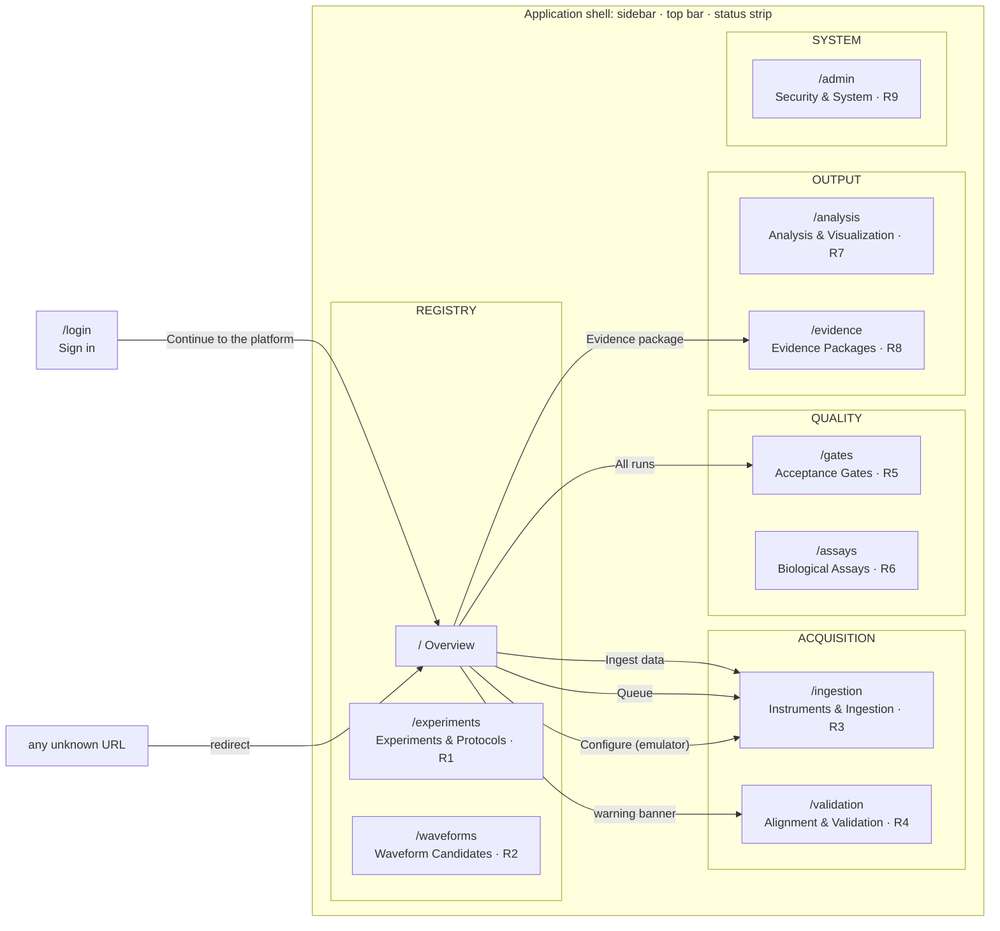
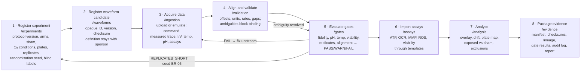
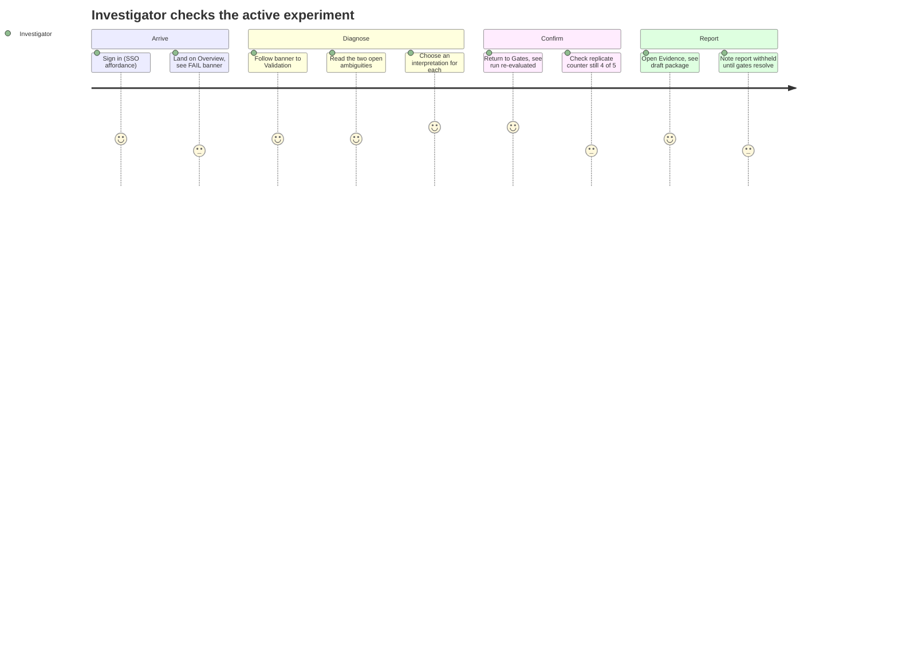
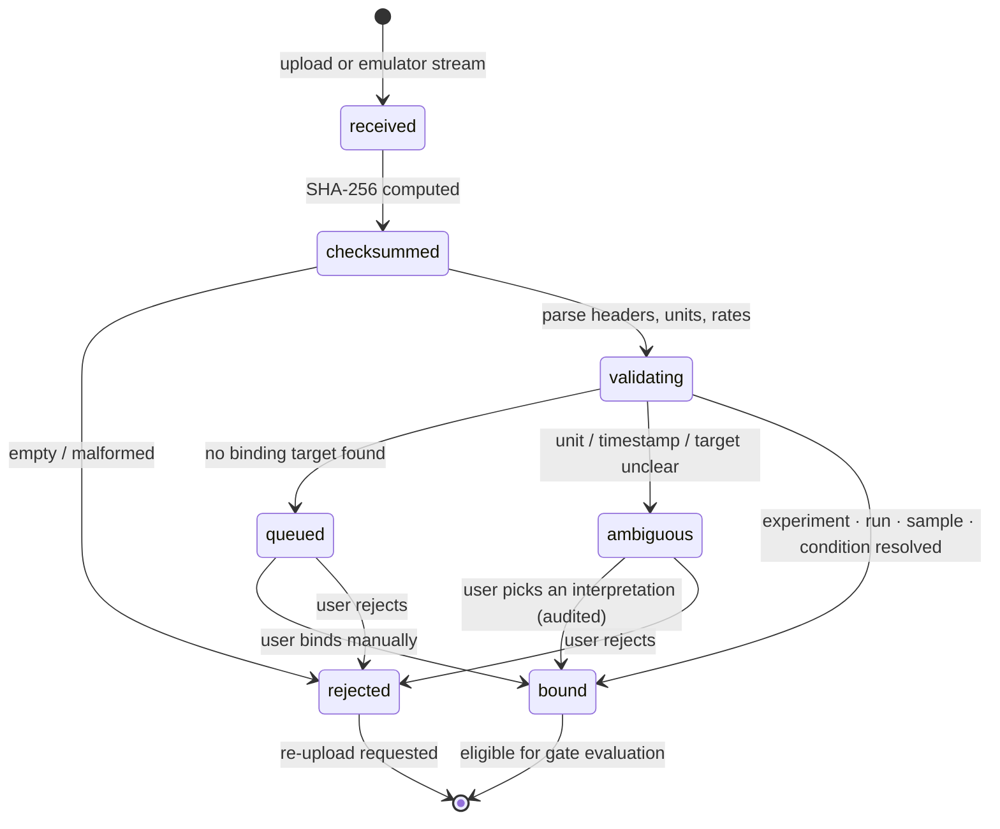
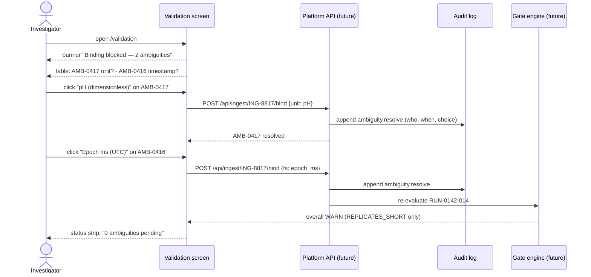
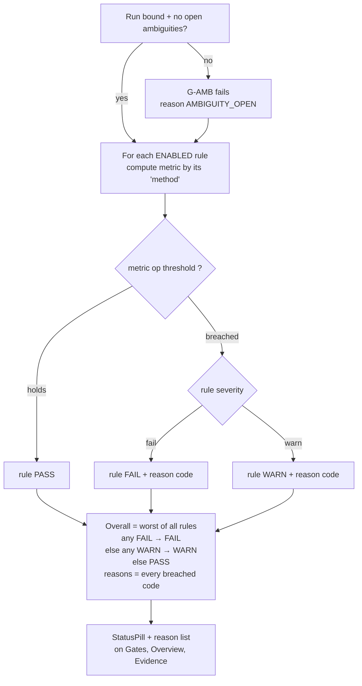
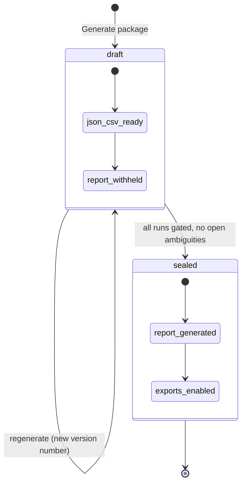
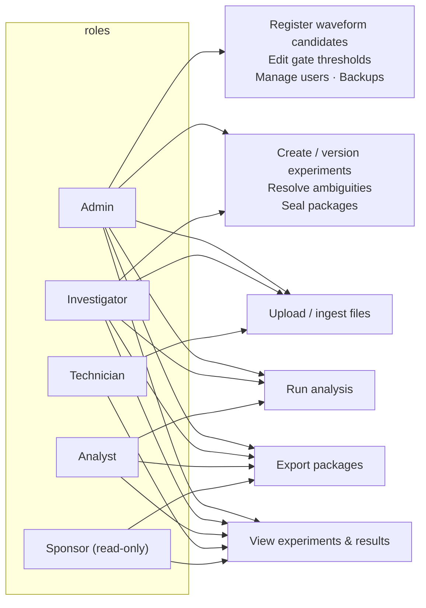
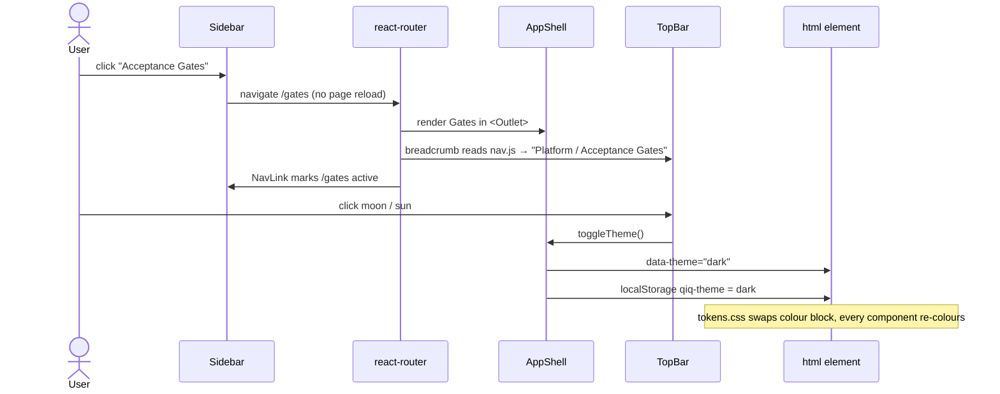

# Demo_site — User flows

How a person moves through the baseline, what each screen shows them, and
how the platform is meant to behave once the affordances are wired. Every
diagram is derived from the screens in this folder. Where a flow describes
future behaviour that the screen already *depicts* (for example resolving an
ambiguity), it is marked **as designed**.

Diagrams are Mermaid; GitHub and VS Code preview render them. Companion
document: [ARCHITECTURE.md](ARCHITECTURE.md).

---

## 1. Navigation map

Every screen, grouped as the sidebar groups them, plus the cross-links that
exist inside screens today.

**Notes**

- The sidebar is always visible, so every screen is one click from every
  other. The arrows above are the *additional* in-page links.
- The top bar's breadcrumb shows `Platform / <screen>`, the active experiment
  (`EXP-2026-0142`), a `RESEARCH USE ONLY` badge, the theme toggle, the
  user's role and initials.
- The status strip at the bottom always shows emulator state, last ingest
  time, pending ambiguity count and API connection.
- Login is reachable only by typing `/login`; nothing redirects to it because
  there is no auth yet.

---

## 2. The evidence chain — primary user journey

The reason the platform exists: prove that a biological result is linked to
the intended waveform, a stable environment, the right sample and an
acceptable replicate structure. The screens are ordered along that chain.

**Notes**

- The baseline's seeded data sits at step 4–5: two ambiguities are open on
  the pH file for `RUN-0142-014`, so that run is FAIL with
  `AMBIGUITY_OPEN`, and every run is WARN with `REPLICATES_SHORT` because
  only 4 of 5 biological replicates exist.
- The loops back to steps 1 and 3 are how the sponsor's "never silently
  accept" rule shows up in practice: a gate failure points at the screen
  where the fix belongs.

---

## 3. A day in the platform (investigator)

**Notes**

- Scores are the intended experience (5 = smooth), not a measurement.
- Every step in this journey is a screen that exists. The two "choose" and
  "re-evaluated" steps are **as designed**: the buttons are there, the
  behaviour is not.

---

## 4. Ingested file lifecycle (as designed)

What the `State` column on the Ingestion screen means, and how a file moves
between states.

**Notes**

- Pills on the screen: `bound` (green), `ambiguous` (amber), `queued`
  (grey), `rejected` (red). Each carries its text label, never colour alone.
- `ambiguous` and `queued` rows show a **Resolve** button; `bound` rows show
  a view icon.
- The seeded queue has one of each non-bound state so reviewers can see them:
  `ING-8817` ambiguous, `ING-8816` queued, `ING-8809` rejected.

---

## 5. Resolving an ambiguity (as designed)

The core rule from requirement 4, as the Validation screen depicts it.

**Notes**

- The platform never guesses. The validator lists the interpretations it
  considered and a human picks one. The choice, the person and the time go
  into the audit log that ships in the evidence package.
- Today the buttons render and carry a tooltip saying they are not wired.

---

## 6. How a gate result is derived

Logic shown on the Gates screen (rule table, per-run results, per-rule
breakdown, reason-code dictionary).

**Notes**

- Rules are data in `src/data/gates.js`: `metric`, `operator`, `threshold`,
  `unit`, `method`, `reasonCode`, `severity`, `enabled`. The screen renders
  that array. Changing a threshold is a data change, which is what
  requirement 5 asks for.
- Seeded thresholds match the sponsor's examples: fidelity ≥ 0.99, pH drift
  ≤ 0.05, temperature drift ≤ 0.1 °C, baseline viability ≥ 90 %,
  replicates ≥ 5. Two extra rules (alignment offset ≤ 20 ms, no open
  ambiguities) show the set is extensible.
- Reason codes list **every** breached rule, not just the worst, so a WARN
  run still tells you what to fix.

---

## 7. Evidence package lifecycle (as designed)

**Notes**

- Machine-readable outputs (JSON manifest, CSV bundle) are available for a
  draft so reviewers can inspect state. The human-readable PDF is withheld
  until gates resolve. The screen shows this with a disabled PDF button on
  the draft row and a warning notice.
- Each package is versioned (`PKG-0142-v1 … v3`) and carries its own
  SHA-256, so a sealed package can be verified later.
- The artifact checklist on the screen mirrors requirement 8's list: protocol
  and candidate IDs, checksums, timestamps, lineage, gate results, settings,
  figures, audit log, report.

---

## 8. Who does what — roles across screens

From the permission matrix on the Admin screen.

**Notes**

- The current fixture user is an Investigator (`MO`), shown in the top bar.
- Only Admin can change gate thresholds or register candidates, which keeps
  the sponsor-defined rules and the custody boundary under one role.
- The sponsor role is read-plus-export: they can pull a sealed package but
  cannot change anything that feeds it.

---

## 9. Shell interactions that *are* wired

The baseline is visual, but three things behave for real.

**Notes**

- Routing, active-link highlighting, breadcrumb and theme persistence are
  real. Refreshing keeps the theme; a hard refresh on any route works in dev
  and in the nginx prod image (history fallback).
- Everything else on the screens is a visual affordance. The rule: if a
  control looks clickable but does nothing, it has a `title` tooltip saying
  "not wired in the baseline", so a demo never misleads.

---

## 10. Screen-by-screen: what the user sees

| Screen | What is on it | What the seeded data is showing |
|---|---|---|
| **Overview** | Five stat readouts, latest gate evaluations, recent ingests, experiment card, replicate meter, emulator card, blocking banner | Latest run FAIL; 4 of 5 replicates; 2 open ambiguities; emulator running |
| **Experiments** | Registry table; detail with tabs; treatment arm cards with blind labels; replicate table; well assignments; protocol version history | `EXP-2026-0142` selected; BR-05 not seeded; arms TX-K4/Q9/M2/W7 |
| **Waveforms** | Custody notice; candidate table with checksums; full record with withheld fields; version history; checksum verifier | `WFC-7A31 v2` selected; carrier/envelope shown as *withheld* |
| **Ingestion** | Six upload zones; emulator control (profile, candidate, run, stream table, start/pause/stop); ingest queue; API reference; ingest contract | pH zone shows 1 pending; queue has bound, ambiguous, queued, rejected rows |
| **Validation** | Blocking notice; ambiguity table with interpretation buttons; exposure-window timeline; environment-window timeline; units table; file findings | pH file: unit unknown, timestamp ambiguous, 30 s gap; 12 ms offset on measured trace |
| **Gates** | Rule set table (editable-looking); run evaluations; per-rule breakdown for selected run; derivation note; reason-code dictionary | Seven rules; six runs mixing WARN and FAIL; `RUN-0142-014` breakdown |
| **Assays** | Endpoint catalogue; import templates; column-mapping preview; canonical schema | Five endpoints; ATP template mapped 6 of 6 required |
| **Analysis** | Non-clinical notice; overlay with residual; temperature and pH drift with bands; exposed-vs-sham table with Hedges' g and CI; plate map; replicate × batch; exclusions; analysis settings | Fidelity 0.994; temperature approaches the 0.1 °C limit; two wells excluded on P01 |
| **Evidence** | Package table with JSON/CSV/PDF; manifest preview; draft notice; artifact checklist; audit log | `PKG-0142-v3` draft, PDF disabled; 9 of 10 artifacts present |
| **Admin** | No-PHI notice; users; permission matrix; error log; backups; deployment facts; automated-test panel | Six users incl. a service account; test suites "not yet written" |
| **Login** | Split layout: evidence-chain summary on the left, SSO button and local form on the right | Link through to Overview since auth is not wired |
